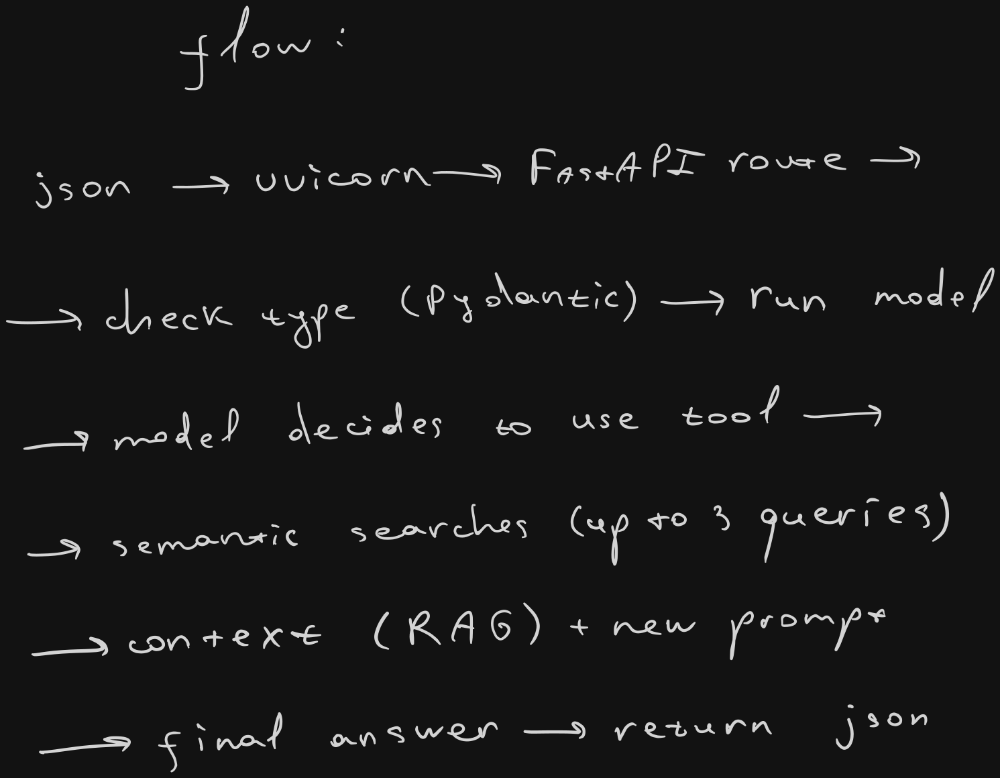

# about this project
this app use ai powers for making embeddings and answer user questions about
stored information in the database. that's all.

## core idea of the app

## nodes to practice
this is simple yet project for learning purposes.
learning goals:
- strengthen python language skills
- asyncio
- fast api
- postgresql (introduction to this dbms) + pgvector + asyncpg
- local ai models (embeddings + simple llm assistants)
- pydantic
- ...and more. i will add new topics later

## arch
monolith. i don't make a purpose to learn or sharpen my existing knowledge about
system design here.
